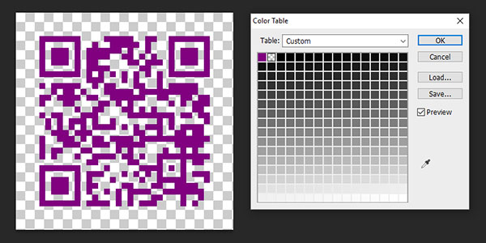

qr-image-color
========

[](https://badge.fury.io/js/qr-image-color)

This is a fork of awesome [alexeyten's](https://github.com/alexeyten/qr-image) qr-image generator.

This fork adds support for custom colors and non-transparent backgrounds in `SVG`, `EPS` and `PDF` files, as well as custom colors and transparent backgrounds in `PNG` files.

For complete description of qr-image please visit [original repo](https://github.com/alexeyten/qr-image).

Overview
--------

* **NEW in this fork:** supports custom colors for code and background, as well as transparent/opaque backgrounds.

[Releases](https://github.com/bockoblur/qr-image/releases/)


Installing
-----

```shell
npm install qr-image-color
```

Color Data Types
-----

You can pass the `color` and `background` options in several ways:

| **Data Type**         | **Color Model**                                                                                   |
|-----------------------|---------------------------------------------------------------------------------------------------|
| `string`              | RGB (as `#rrggbb`, with or without leading `#`; as `#rgb`, (short notation); or as CSS color name |
| `number`              | Gray in range 0.0…1.0  (0.0=black, 1.0=white)                                                     |
| `Array(3)` of numbers | RGB (Components in range 0…255)                                                                   |
| `Array(4)` of numbers | CMYK (Components in range 0.0…1.0)                                                                |

Color Model Support Overview
-----

|               |      **PDF**     |      **EPS**     |      **SVG**      |      **PNG**     |
|--------------:|:----------------:|:----------------:|:-----------------:|:----------------:|
| **Gray**      |         ✓        |         ✓        | ⤑ Hex |      ⤑ RGB[1]       |
| **RGB**       |         ✓        |         ✓        | ⤑ Hex |         ✓ [1]       |
| **CMYK**      |         ✓        |         ✓        | ⤑ Hex[2] |      ⤑ RGB[2]       |
| **Hex Color** | ⤑ RGB | ⤑ RGB |         ✓        |       ⤑ RGB      |

[1] **NOTE:** Generated QR-codes are *Indexed Color* PNG files. See note about  `customize` option below. 

[2] No attempt has been made to use calibrated conversion from CMYK to RGB, so if you use CMYK colors in `SVG` or `PNG`, do not expect prepress-quality conversion. If you need precise CMYK color control, use `PDF` or `EPS` files, since they have native CMYK support.


Usage
-----

Examples:
```javascript
var qr = require('qr-image-color');

var qr_svg = qr.image('I love Default QR (with black/transparent)!', { type: 'svg' });
qr_svg.pipe(require('fs').createWriteStream('i_love_qr.svg'));

// use foreground color (CMYK) and no background;
var pdf_string = qr.imageSync('I love Color QR!', { type: 'pdf', color: [0.7, 0, 0, 1]  });

// use foreground color (RGB) and light gray (10% Black) background;
var eps_string = qr.imageSync('I love Color QR!', { type: 'eps', color: [128, 0, 64], background: [0,0,0,0.1], transparent: false });

// png with purple color and transparent background;
var png_string = qr.imageSync('I love transparent QR in PNG!', { type: 'png', color: "purple", transparent: true });

```

### Example of transparent PNG with color "purple"




[More examples](./examples)

### Methods

  * `qr.image(text, [ec_level | options])` — Readable stream with image data;
  * `qr.imageSync(text, [ec_level | options])` — string with image data. (Buffer for `png`);
  * `qr.svgObject(text, [ec_level | options])` — object with SVG path and size;
  * `qr.matrix(text, [ec_level])` — 2D array.


### Options

  * `text` — text to encode;
  * `ec_level` — error correction level. One of `L`, `M`, `Q`, `H`. Default `M`.
  * `options` — image options object:
    * `ec_level` — default `M`.
    * `type` — image type. Possible values `png` (default), `svg`, `pdf` and `eps`.
    * `size` (png and svg only) — size of one module in pixels. Default `5` for png and `undefined` for svg.
    * `margin` — white space around QR image in modules. Default `4` for `png` and `1` for others.
    * `customize` (only png) — function to customize qr bitmap before encoding to PNG. **We are now using Index Color PNG instead of grayscale, so using this option will behave different**
    * `parse_url` (experimental, default `false`) — try to optimize QR-code for URLs.
  * **NEW options**
    * `transparent` (`boolean`) For `PNG`, default is `false`, for vector formats default is `true`. I choose these defaults to keep the behaviour as it was earlier, in case  `transparent` option is not explicitly set. If set to `true`, then `background` parameter is ignored. If set to `false`, and no `background` is specified, background defaults to white. 
    * `color` color for code blocks. If omitted, default is pure black.
    * `background` color for code background. If omitted, default is transparent.

TODO
----

  * Tests;
